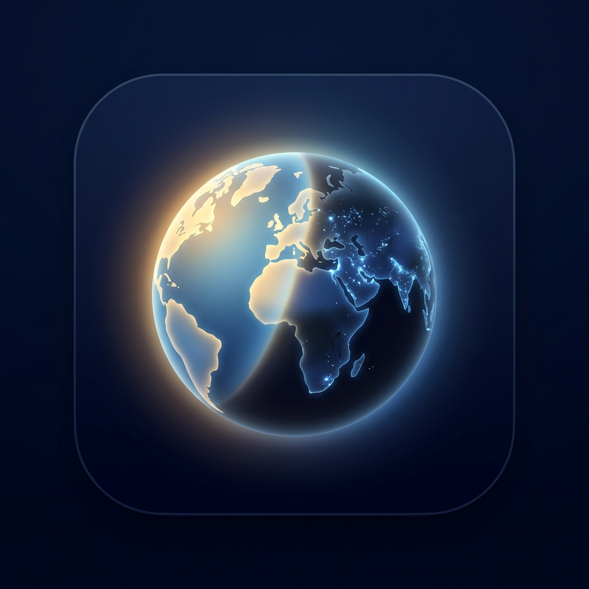
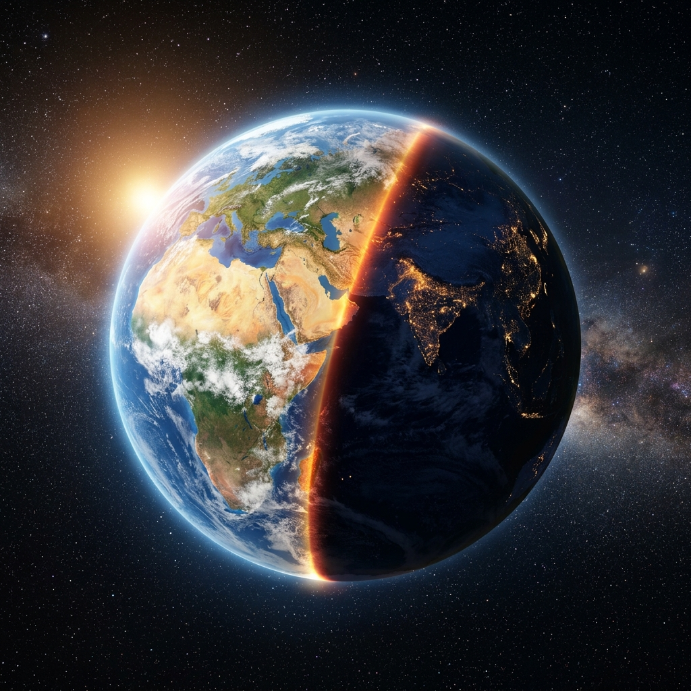

<p align="center">
  
</p>

<h1 align="center">EarthLive Wallpaper</h1>

<p align="center">
  <strong>A premium real-time 3D Earth live wallpaper for Windows 11.</strong><br />
  Location-aware sunlight terminator boundary calculations with ultra-low resource footprint.
</p>

<p align="center">
  
  
  
  
</p>

---

<p align="center">
  
</p>

## ✨ Key Features

*   🌍 **Stunning 3D Globe** — Beautifully detailed 3D Earth rendering powered by **CesiumJS**, including smooth orbital controls and auto-rotation.
*   ☀️ **Live Sunlight Boundary** — Calculates the real-time day/night terminator based on astronomy formulas, updating dynamically as the earth rotates.
*   🔒 **Privacy First** — Your location coordinates are cached only in local settings. Absolutely no telemetry, backend requests, or tracking.
*   ⚙️ **Lively Wallpaper Web Format** — Ready-to-use bundle for the open-source Windows Lively Wallpaper engine. Automatically scales and optimizes frame rates.
*   🔋 **Eco Mode & Efficiency** — Targeted low frame-rate lock (under 30 FPS) to conserve GPU resources while you work or game.

---

## 🛠️ Tech Stack

| Component | Technology | Description |
| :--- | :--- | :--- |
| **Engine** | [CesiumJS](https://cesium.com/platform/cesiumjs/) | High-performance 3D mapping and spatial globe |
| **Solar Math**| Custom / SunCalc | Day/night terminator & sun altitude calculations |
| **Runtime** | Lively Wallpaper (Web) | Host container for interactive Windows web wallpapers |
| **Build Tool**| Vite + TypeScript | Blazing fast development server and optimized packaging |
| **Aesthetics**| CSS3 Neon & Glass | Premium glassmorphism overlay design |

---

## 🚀 Getting Started

Follow these steps to run the wallpaper project locally for development.

### Prerequisites

Make sure you have Node.js (version 18 or above) installed on your machine.

### Installation

```bash
# Clone the repository
git clone https://github.com/jeiel85/earth-live-wallpaper.git
cd earth-live-wallpaper

# Navigate to the web app directory and install dependencies
cd apps/wallpaper-web
npm install
```

### Run Local Development Server

```bash
npm run dev
```

The server will start at `http://localhost:5173`. You can open this in your browser to view the interactive 3D globe.

### Build Production Bundle

To build a minimized standalone bundle for Lively Wallpaper:

```bash
npm run build
```

The output will be generated inside `apps/wallpaper-web/dist/`.

---

## 🖥️ Lively Wallpaper Integration

To register this project as a live wallpaper on your Windows 11 Desktop:

1.  Open **Lively Wallpaper** (make sure it's installed on your system).
2.  Click **Add Wallpaper** (+ icon in the sidebar).
3.  Click **Browse** and select `apps/wallpaper-web/dist/index.html` (or the folder itself if uploading local assets).
4.  Lively will automatically parse the layout. Set the title as **EarthLive Wallpaper** and hit OK.

---

## 📂 Project Structure

```
apps/wallpaper-web/     → Interactive wallpaper web application
├── src/renderer/       → CesiumJS 3D globe rendering & cameras
├── src/solar/          → Astronomy calculations (terminator paths)
├── src/location/       → Geolocation handling (fallback configurations)
├── src/settings/       → Storage for local UI settings
├── src/weather/        → Optional weather layers (future)
├── src/ui/             → Glassmorphic sidebar & location setup UI
└── src/styles/         → Premium dark theme stylesheet
docs/                   → Product specification and technical designs
```

---

## 📖 Design & Architecture Docs

Detailed specs and technical notes can be found in the [`docs/`](./docs/) directory:

*   [Product Specification](./docs/01_product_spec.md) — Core goals and target features
*   [Architecture Design](./docs/02_architecture.md) — Data flow and system structure
*   [MVP Scope](./docs/03_mvp_scope.md) — What is built in the first milestone
*   [Rendering & CesiumJS](./docs/05_rendering_design.md) — WebGL optimizations
*   [Location & Privacy](./docs/06_location_privacy_design.md) — Privacy-first specifications
*   [Lively Integration Specs](./docs/07_lively_wallpaper_integration.md) — Web wallpaper configurations

---

## 📄 License

This project is open-source and licensed under the **MIT License**. See [LICENSE](LICENSE) for details.
